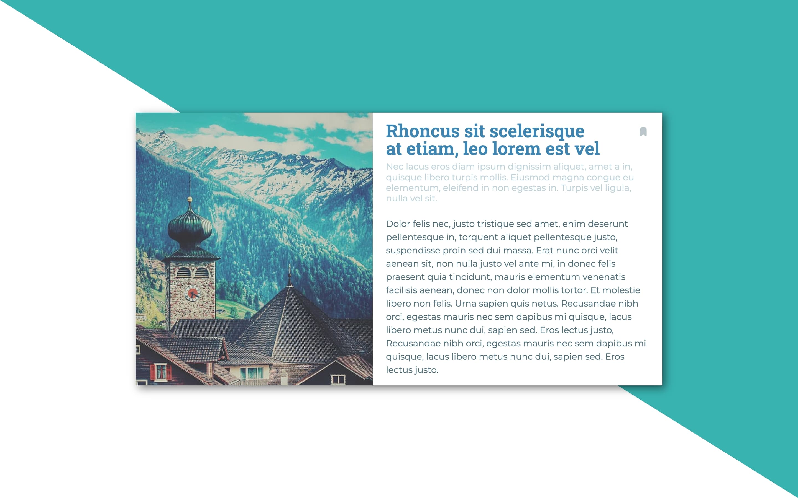
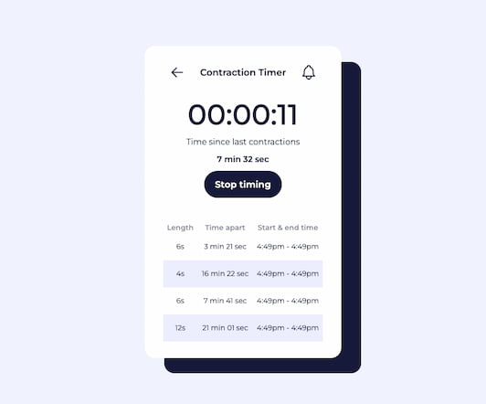

# I Code This - Challenges

[I Code This](https://iCodeThis.com/?ref=Katrien) stopped providing daily challenges, as users wanted to have more time to complete the challenges. This repository is a growing collection of challenges solved for the platform. Part 3.

## Table of contents

- [Intro](#intro)
- [Challenges](#challenges)
- [Useful Resources](#usefulresources)
- [Author](#author)

## Intro

All the solutions are deployed on Github using Github Pages. You'll find the links here in ascending order (latest exercise on top).
Unless noted otherwise, the building of the exercises is done with:

- Semantic HTML5 markup
- CSS custom properties
- Flexbox
- CSS Grid
- Mobile-first workflow
- Vanilla JS

## Challenges

### Challenge 130

- [Code URL](https://github.com/katrien-s/icodethis-challenges/tree/main/130-dashboard-ui)
- [Live URL](https://katrien-s.github.io/icodethis-challenges/130-dashboard-ui)

### Challenge 129

- [Code URL](https://github.com/katrien-s/icodethis-challenges/tree/main/128-blog-post)
- [Live URL](https://katrien-s.github.io/icodethis-challenges/128-blog-post)

### Challenge 128

- [Code URL](https://github.com/katrien-s/icodethis-challenges/tree/main/128-blog-post)
- [Live URL](https://katrien-s.github.io/icodethis-challenges/128-blog-post)

### Challenge 127

- [Code URL](https://github.com/katrien-s/icodethis-challenges/tree/main/127-accordion)
- [Live URL](https://katrien-s.github.io/icodethis-challenges/127-accordion)

### Useful resources

- [Detecting the opening or closing of a details element](https://stackoverflow.com/questions/7363117/detecting-the-opening-or-closing-of-a-details-element)

### Challenge 126

- [Code URL](https://github.com/katrien-s/icodethis-challenges/tree/main/126-social-profile)
- [Live URL](https://katrien-s.github.io/icodethis-challenges/126-social-profile)

### Useful resources

Two resources I used to figure out how to do a grid of squares. I eventually took the CSS Tricks-approach.

- [#179: A Grid of Squares](https://css-tricks.com/videos/179-a-grid-of-squares/)
- [CSS grid square layout](https://stackoverflow.com/questions/54927180/css-grid-square-layout)

---

### Challenge 125

- [Code URL](https://github.com/katrien-s/icodethis-challenges/tree/main/125-job-list)
- [Live URL](https://katrien-s.github.io/icodethis-challenges/125-job-list)

---

### Challenge 124

- [Code URL](https://github.com/katrien-s/icodethis-challenges/tree/main/124-coming-soon)
- [Live URL](https://katrien-s.github.io/icodethis-challenges/124-coming-soon)

---

### Challenge 123

- [Code URL](https://github.com/katrien-s/icodethis-challenges/tree/main/123-contraction-timer)
- [Live URL](https://katrien-s.github.io/icodethis-challenges/123-contraction-timer)

---

### Challenge 121

- [Code URL](https://github.com/katrien-s/icodethis-challenges/tree/main/121-blog-comps)
- [Live URL](https://katrien-s.github.io/icodethis-challenges/121-blog-comps)

---

### Challenge 120

- [Code URL](https://github.com/katrien-s/icodethis-challenges/tree/main/120-sync-component)
- [Live URL](https://katrien-s.github.io/icodethis-challenges/120-sync-component)

---

### Challenge 119

- [Code URL](https://github.com/katrien-s/icodethis-challenges/tree/main/119-jo-s-burger-event)
- [Live URL](https://katrien-s.github.io/icodethis-challenges/119-jo-s-burger-event)

---

### Challenge 118

- [Code URL](https://github.com/katrien-s/icodethis-challenges/tree/main/118-pricing-table)
- [Live URL](https://katrien-s.github.io/icodethis-challenges/118-pricing-table)

**Useful Resources**

- For the animation of the background, I used [gradient-animator](https://www.gradient-animator.com/)

---

### Challenge 117

- [Code URL](https://github.com/katrien-s/icodethis-challenges/tree/main/117-movie-card)
- [Live URL](https://katrien-s.github.io/icodethis-challenges/117-movie-card)

---

## Author

- Website - [Katrien S](https://www.katriens.be)
- Twitter - [@katrien-s](https://www.twitter.com/katrien-s)
