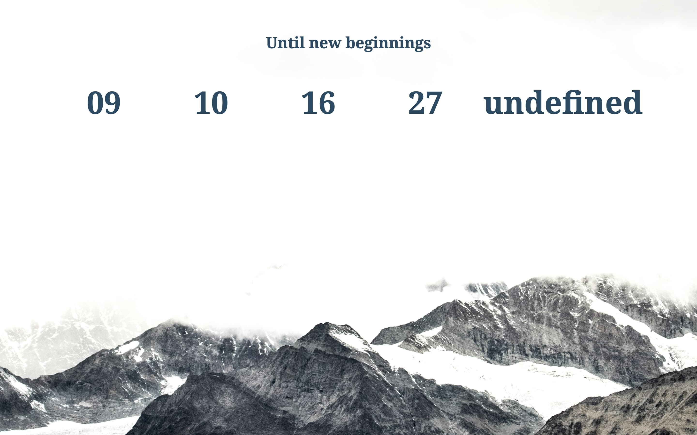
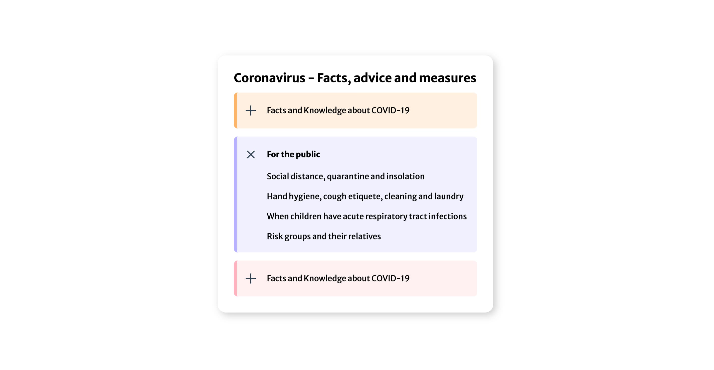
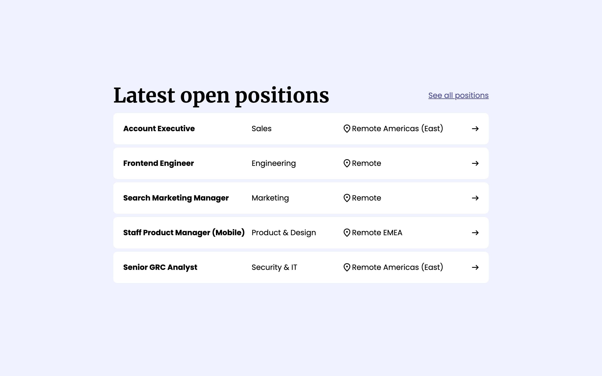
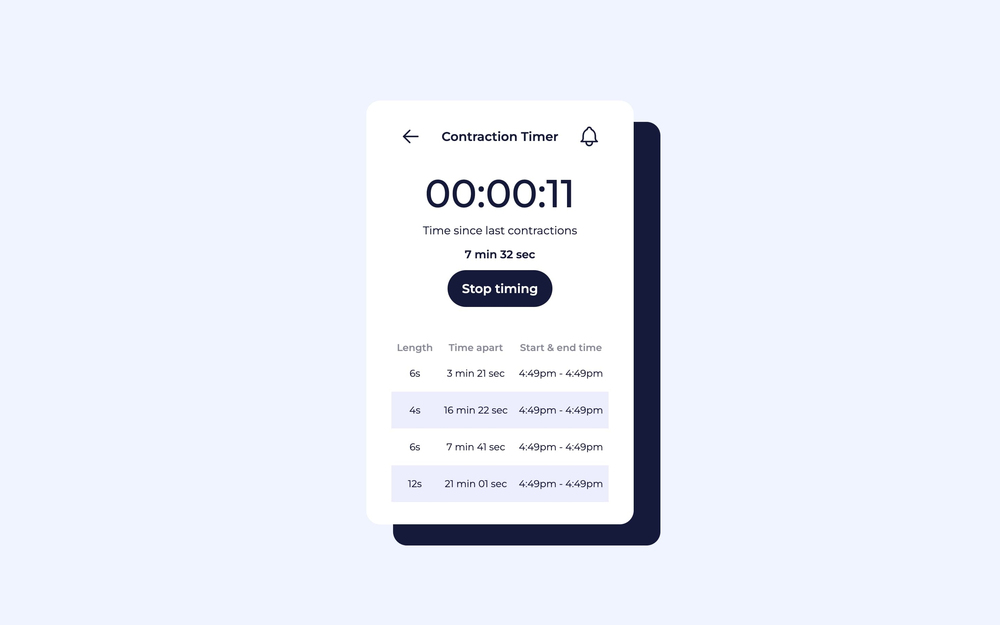
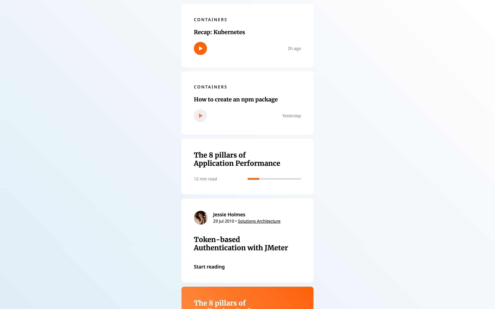
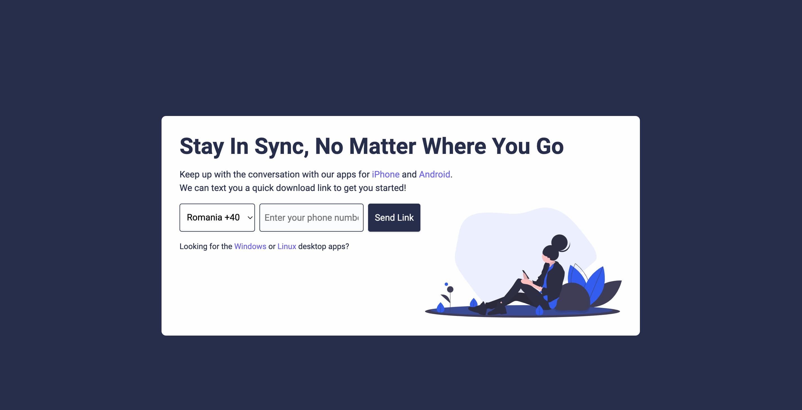

# I Code This - Challenges

This repository is a growing collection of challenges solved for [I Code This](https://iCodeThis.com/?ref=Katrien). Part 3.

## Table of contents

- [Intro](#intro)
- [Challenges](#challenges)

## Intro

All the solutions are deployed on Github using Github Pages. You'll find the links here in ascending order (latest exercise on top).
Each project showcases a variety of skills and technologies used in modern development.

## Challenges

<!-- 131 -->
<table align="center">
  <tr>
    <td width="50%">
      <h2 align="center">#131: Website Comps</h2>
      <h3 align="center">
        
      </h3>
      

        <a href="https://katrien-s.github.io/icodethis-challenges/131-website-comps" target="_blank">Live</a> | <a href="https://github.com/katrien-s/icodethis-challenges/tree/main/131-website-comps" target="_blank">Repo</a>
      

    </td>
    <td width="50%">
      <picture>
        
      </picture>
    </td>
  </tr>
</table>

<!-- 130 -->
<table align="center">
  <tr>
    <td width="50%">
      <h2 align="center">#130: Dashboard UI</h2>
      <h3 align="center">
        
      </h3>
      

        <a href="https://katrien-s.github.io/icodethis-challenges/130-dashboard-ui" target="_blank">Live</a> | 
        <a href="https://github.com/katrien-s/icodethis-challenges/tree/main/130-dashboard-ui" target="_blank">Repo</a>
      

    </td>
    <td width="50%">
      <picture>
        
      </picture>
    </td>
  </tr>
</table>

<!-- 129 -->
<table align="center">
  <tr>
    <td width="50%">
      <h2 align="center">#129: Countdown</h2>
      <h3 align="center">
        
      </h3>
      

        <a href="https://katrien-s.github.io/icodethis-challenges/129-countdown" target="_blank">Live</a> | 
        <a href="https://github.com/katrien-s/icodethis-challenges/tree/main/129-countdown" target="_blank">Repo</a>
      

    </td>
    <td width="50%">
      <picture>
        
      </picture>
    </td>
  </tr>
</table>

<!-- 128 -->
<table align="center">
  <tr>
    <td width="50%">
      <h2 align="center">#128: Blog Post</h2>
      <h3 align="center">
        
      </h3>
      

        <a href="https://katrien-s.github.io/icodethis-challenges/128-blog-post" target="_blank">Live</a> | 
        <a href="https://github.com/katrien-s/icodethis-challenges/tree/main/128-blog-post" target="_blank">Repo</a>
      

    </td>
    <td width="50%">
      <picture>
        
      </picture>
    </td>
  </tr>
</table>

<!-- 127 -->
<table align="center">
  <tr>
    <td width="50%">
      <h2 align="center">#127: Accordion</h2>
      <h3 align="center">
        
      </h3>
      

        <a href="https://katrien-s.github.io/icodethis-challenges/127-accordion" target="_blank">Live</a> | 
        <a href="https://github.com/katrien-s/icodethis-challenges/tree/main/127-accordion" target="_blank">Repo</a>
      

      
<strong>Useful Resource:</strong> <a href="https://stackoverflow.com/questions/7363117/detecting-the-opening-or-closing-of-a-details-element" target="_blank"> Detecting the opening or closing of a details element
      

    </td>
    <td width="50%">
      <picture>
        
      </picture>
    </td>
  </tr>
</table>

<!-- 126 -->
<table align="center">
  <tr>
    <td width="50%">
      <h2 align="center">#126: Social Profile</h2>
      <h3 align="center">
        
      </h3>
      

        <a href="https://katrien-s.github.io/icodethis-challenges/126-social-profile" target="_blank">Live</a> | 
        <a href="https://github.com/katrien-s/icodethis-challenges/tree/main/126-social-profile" target="_blank">Repo</a>
      

      
<strong>Useful Resource</strong>: Two resources I used to figure out how to do a grid of squares. I eventually took the CSS Tricks-approach. 
        <a href="https://css-tricks.com/videos/179-a-grid-of-squares/" target="_blank">#179: A Grid of Squares </a> 
        <a href="https://stackoverflow.com/questions/54927180/css-grid-square-layout" target="_blank"> CSS grid square layout</a>
      

    </td>
    <td width="50%">
      <picture>
        
      </picture>
    </td>
  </tr>
</table>

<!-- 125 -->
<table align="center">
  <tr>
    <td width="50%">
      <h2 align="center">#125: Job List</h2>
      <h3 align="center">
        
      </h3>
      

        <a href="https://katrien-s.github.io/icodethis-challenges/125-job-list" target="_blank">Live</a> | 
        <a href="https://github.com/katrien-s/icodethis-challenges/tree/main/125-job-list" target="_blank">Repo</a>
      

    </td>
    <td width="50%">
      <picture>
        
      </picture>
    </td>
  </tr>
</table>

<!-- 124 -->
<table align="center">
  <tr>
    <td width="50%">
      <h2 align="center">#124: Coming Soon</h2>
      <h3 align="center">
        
      </h3>
      

        <a href="https://katrien-s.github.io/icodethis-challenges/124-coming-soon" target="_blank">Live</a> | 
        <a href="https://github.com/katrien-s/icodethis-challenges/tree/main/124-coming-soon" target="_blank">Repo</a>
      

    </td>
    <td width="50%">
      <picture>
        
      </picture>
    </td>
  </tr>
</table>

<!-- 123 -->
<table align="center">
  <tr>
    <td width="50%">
      <h2 align="center">#123: Contraction Timer</h2>
      <h3 align="center">
        
      </h3>
      

        <a href="https://katrien-s.github.io/icodethis-challenges/123-contraction-timer" target="_blank">Live</a> | 
        <a href="https://github.com/katrien-s/icodethis-challenges/tree/main/123-contraction-timer" target="_blank">Repo</a>
      

    </td>
    <td width="50%">
      <picture>
        
      </picture>
    </td>
  </tr>
</table>

<!-- 122 -->
<table align="center">
  <tr>
    <td width="50%">
      <h2 align="center">#122: Calendar Comps</h2>
      <!-- <h3 align="center">
        
      </h3> -->
      <h3 align="center">Project is unfinished</h3>
      

        <a href="https://katrien-s.github.io/icodethis-challenges/122-calendar-comps/" target="_blank">Live</a> | 
        <a href="https://github.com/katrien-s/icodethis-challenges/tree/main/122-calendar-comps" target="_blank">Repo</a>
      

    </td>
    <td width="50%">
      <picture>
        
      </picture>
    </td>
  </tr>
</table>

<!-- 121 -->
<table align="center">
  <tr>
    <td width="50%">
      <h2 align="center">#121: Blog Comps</h2>
      <h3 align="center">
        
      </h3>
      

        <a href="https://katrien-s.github.io/icodethis-challenges/121-blog-comps" target="_blank">Live</a> | 
        <a href="https://github.com/katrien-s/icodethis-challenges/tree/main/121-blog-comps" target="_blank">Repo</a>
      

    </td>
    <td width="50%">
      <picture>
        
      </picture>
    </td>
  </tr>
</table>

<!-- 120 -->
<table align="center">
  <tr>
    <td width="50%">
      <h2 align="center">#120: Sync Component</h2>
      <h3 align="center">
        
      </h3>
      

        <a href="https://katrien-s.github.io/icodethis-challenges/120-sync-component" target="_blank">Live</a> | 
        <a href="https://github.com/katrien-s/icodethis-challenges/tree/main/120-sync-component" target="_blank">Repo</a>
      

    </td>
    <td width="50%">
      <picture>
        
      </picture>
    </td>
  </tr>
</table>

<!-- 119 -->
<table align="center">
  <tr>
    <td width="50%">
      <h2 align="center">#119: Jo's Burger Event</h2>
      <h3 align="center">
        
      </h3>
      

        <a href="https://katrien-s.github.io/icodethis-challenges/119-jo-s-burger-event" target="_blank">Live</a> | 
        <a href="https://github.com/katrien-s/icodethis-challenges/tree/main/119-jo-s-burger-event" target="_blank">Repo</a>
      

    </td>
    <td width="50%">
      <picture>
        
      </picture>
    </td>
  </tr>
</table>

<!-- 118 -->
<table align="center">
  <tr>
    <td width="50%">
      <h2 align="center">#118: Pricing Table</h2>
      <h3 align="center">
        
      </h3>
      

        <a href="https://katrien-s.github.io/icodethis-challenges/118-pricing-table" target="_blank">Live</a> | 
        <a href="https://github.com/katrien-s/icodethis-challenges/tree/main/118-pricing-table" target="_blank">Repo</a>
      

      
<strong>Useful Resource:</strong>For the animation of the background, I used <a href="https://www.gradient-animator.com/" target="_blank"> gradient-animator
      

    </td>
    <td width="50%">
      <picture>
        
      </picture>
    </td>
  </tr>
</table>

<!-- 117 -->
<table align="center">
  <tr>
    <td width="50%">
      <h2 align="center">#117: Movie Card</h2>
      <h3 align="center">
        
      </h3>
      

        <a href="https://katrien-s.github.io/icodethis-challenges/117-movie-card" target="_blank">Live</a> | 
        <a href="https://github.com/katrien-s/icodethis-challenges/tree/main/117-movie-card" target="_blank">Repo</a>
      

    </td>
    <td width="50%">
      <picture>
        
      </picture>
    </td>
  </tr>
</table>
